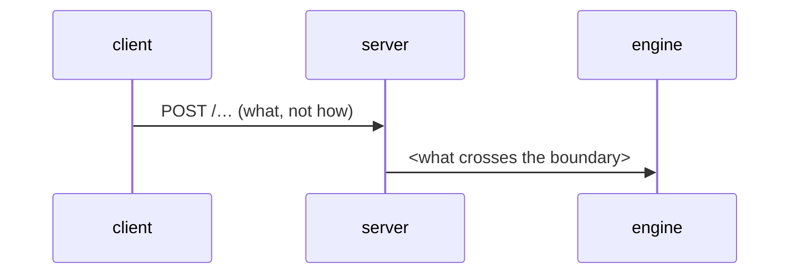

# Spec template

Copy this structure exactly — every section, in order. Write `—` for a
genuinely empty section (e.g. no predecessor to supersede, no relevant
non-functionals) instead of deleting it. HTML comments explain intent and
should be dropped from the final spec.

```markdown
# Spec: <feature>  |  Spec ID: SPEC-NN  |  Status: draft
Supersedes: <link to the older spec this decision replaces, or "—">
Modules: <comma-separated modules this spec touches, e.g. server, client>

## Problem & why
<the user/business problem, and why it matters now — 2–5 sentences>

## Goals / Non-goals
**Goals:**
- …

**Non-goals:**   <!-- explicit boundaries — what we are deliberately NOT doing -->
- …

## User stories
<!-- stable IDs — ACs trace back to them via "covers:" -->
- **US-1** — As a <role>, I want <capability>, so that <outcome>.

## Acceptance criteria (EARS)
<!-- each testable, each with a stable ID; patterns and examples in ears.md.
     Traceability: Goal/US → AC → downstream plan R-ID. -->
- **AC-1** — WHEN <trigger>, the system SHALL <response>. (covers: US-1)
- **AC-2** — IF <failure condition>, THEN the system SHALL <response>. (covers: US-1)
- **AC-3** — The system SHALL <ubiquitous obligation>. (covers: US-2)

## Verification hints
<!-- per AC, the KIND of check that proves it — hermetic unit / DB-backed
     *.it.test.ts / e2e flow / manual — never test code. -->
- AC-1 — <e.g. e2e flow: submitting the form lands on /pulls>
- AC-2 — <e.g. hermetic unit with MockLLMProvider: failure renders skeleton>

## Edge cases
<!-- empty/zero/one/many, dependency failures, concurrency, stale data, permissions -->
- …

## Non-functional
<!-- perf / security / a11y — only if relevant; otherwise "—" -->
- …

## Flows & interactions
<!-- optional; otherwise "—". Workflows, state machines, and service/module
     communication — WHO talks to WHOM and WHAT crosses the boundary.
     Mermaid preferred (sequence / flowchart / state). Actors are modules
     (client, server, engine, external APIs), edges are messages/events
     — never classes, functions, or file paths. -->


## Contracts
<!-- optional; otherwise "—". Data shapes / API surfaces the feature introduces
     or changes: field names, types, semantics, nullability — as narrative or
     a table. NO code (no TS/Zod snippets), no schema-file paths; the
     implementation plan decides where the contract lives. -->
| Field | Type | Semantics |
| --- | --- | --- |
| … | … | … |

## Inputs (provenance)
<!-- where each functional input comes from; count new LLM calls explicitly -->
- <input> — [reused: L0X] | [deterministic: repo-intel] | [new: 1 LLM call]

## Untrusted inputs
<!-- does the feature read third-party text (PR bodies, diffs, external docs,
     model output)? If yes: state it is handled as data, not commands
     (wrapUntrusted / INJECTION_GUARD). If no: "N/A — reads no third-party text." -->
- …

## [NEEDS CLARIFICATION: …]
<!-- open questions; each one blocks Status → approved. Delete the section
     header only when the list is empty AND the status is being flipped. -->
- …
```

## Index entry

After writing the spec, append to the same folder's `README.md`:

```markdown
- [SPEC-NN — <feature>](SPEC-NN-YYYY-MM-<slug>.md) — <one-line hook> (draft)
```
